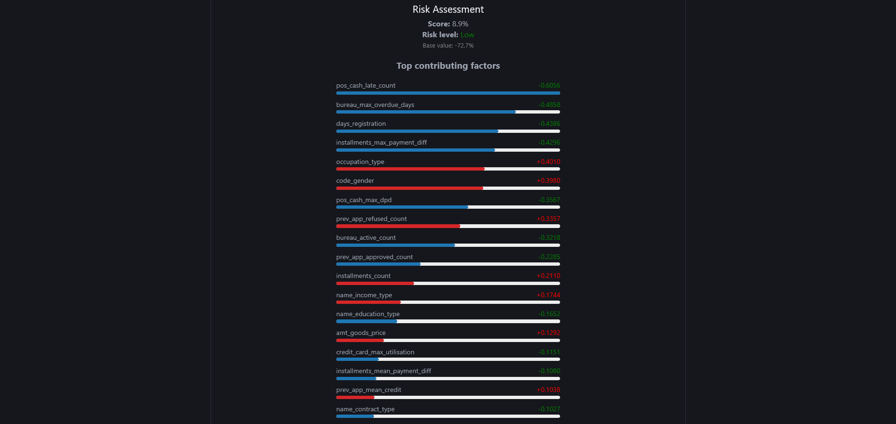
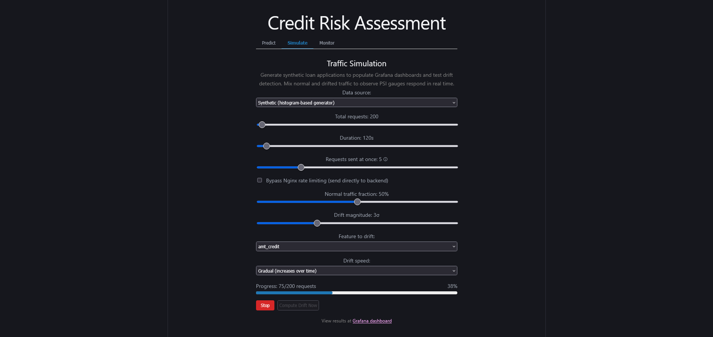
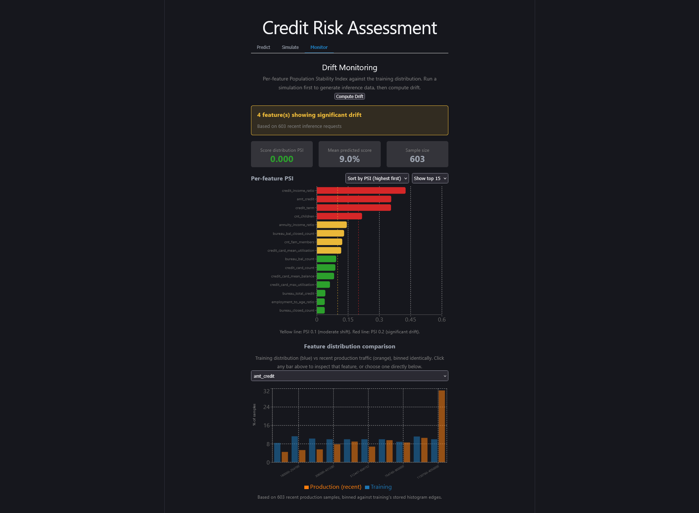
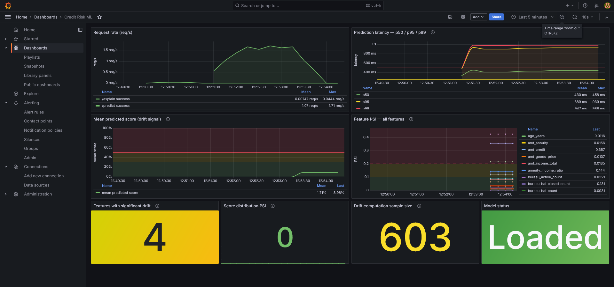
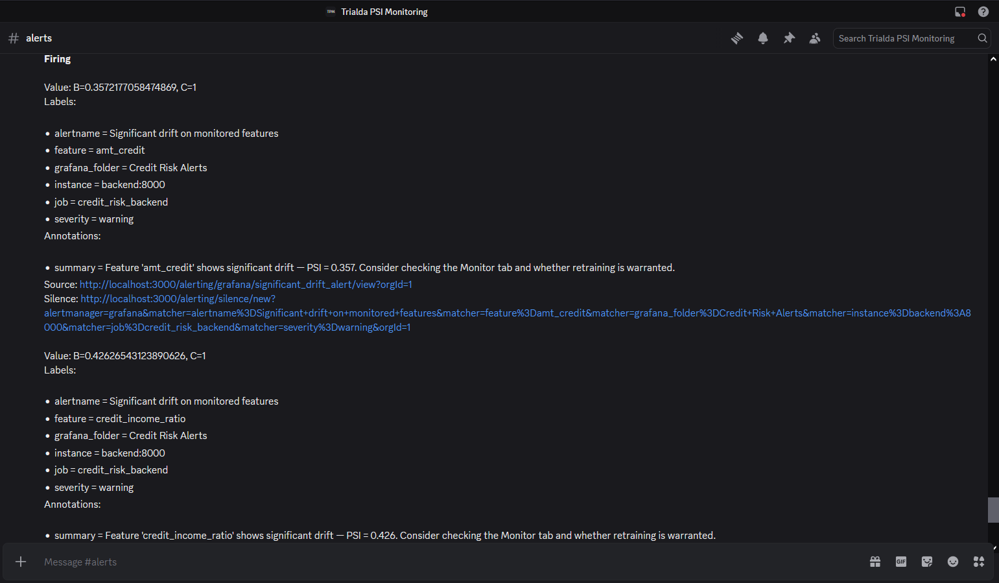
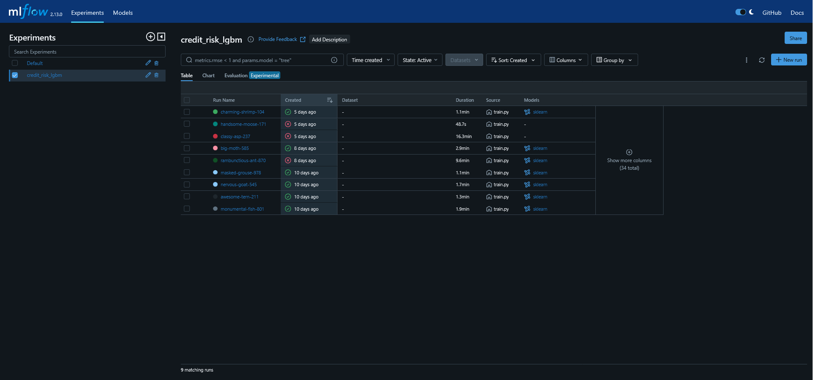
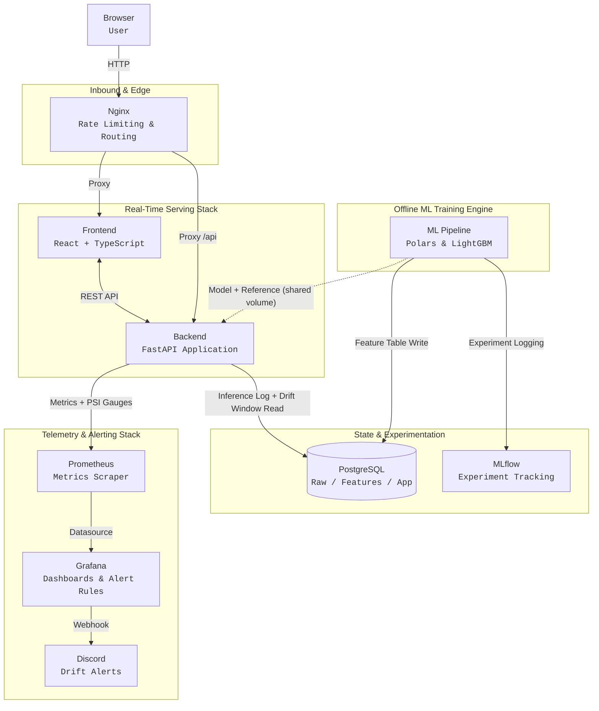

# Credit Risk ML

[](https://github.com/Trialda/credit-risk-ml/actions/workflows/ci.yml) &nbsp; [](https://opensource.org/licenses/MIT)

[Screenshots](#screenshots) · [Architecture](#architecture) · [Tech stack](#tech-stack) · [Getting started](#getting-started) · [Using the application](#using-the-application) 
[Model details](#model-details) · [Drift detection design](#drift-detection-design) · [Known limitations](#known-limitations) · [Data licensing](#data-licensing) · [Deployment](#deployment)

Production-grade credit risk scoring system and drift monitoring platform. 
Many ML projects focus on just training code, this project is built as a complete, 
containerized demonstration of system-level MLOps, tackling the delayed feedback
loop problem in lending, where model performance decay cannot be measured 
using real-time ground-truth labels.

## What this project covers

- ML pipeline: SQL-based feature engineering across 7 relational
  tables, LightGBM with MLflow experiment tracking, SHAP explanations
- API: FastAPI, dual-layer validation (Pydantic + Pandera), Nginx
  rate limiting, API key auth
- Drift detection: histogram-based Population Stability Index (PSI), 
  computed against a stored training reference, implemented directly
- Monitoring: Prometheus + Grafana for infrastructure, a React + Typescript
  dashboard for per-feature drift inspection, Discord alerts on a
  curated feature set
- A traffic simulator with two modes (synthetic and real held-out
  data) for generating test traffic and exercising drift detection


## Screenshots

### Predict & SHAP


### Simulate traffic


### Monitor Drift (PSI)


### Grafana dashboard


### Discord webhook alerting


### MLflow experiment tracking


## Architecture



**Request flow (prediction):** Nginx routes `/api/predict` to the
backend → Pydantic validates the request shape → Pandera validates
feature values against domain constraints → LightGBM scores the
application → SHAP computes per-feature contributions → the request,
score, and SHAP values are logged to Postgres → the response (score +
explanation) returns to the frontend.

**Request flow (drift detection):** the inference log accumulates
real (or simulated) traffic. On demand, the backend reads a recent
window from the log, bins each feature's values against the stored
training histogram, and computes PSI per feature. Results update
Prometheus gauges, which Grafana reads for dashboards and alert
evaluation.

**Why this split:** the ML pipeline (ingestion, feature engineering,
training) runs as a separate Docker profile, not inside the serving
path: training is expensive and infrequent, serving needs to be fast
and always available.

## Tech stack

| Layer | Tools |
|---|---|
| ML | Python, Polars, LightGBM, SHAP, MLflow |
| Backend | FastAPI, SQLAlchemy, Alembic, Pandera, Pydantic |
| Frontend | React, TypeScript, Vite, Recharts |
| Data | PostgreSQL |
| Observability | Prometheus, Grafana |
| Gateway | Nginx |
| Infra | Docker Compose (local) |
| CI | GitHub Actions |

Polars is used for ingestion and feature engineering: large
analytical joins on tables exceeding 10M+ rows; Pandas only appears
at the LightGBM/sklearn boundary, since that's the API those
libraries expect.

## Getting started

### Prerequisites

- Docker and Docker Compose
- A [Kaggle](https://www.kaggle.com) account (free), needed to
  download the dataset this project trains on
- ~6GB free disk space for the dataset and Docker images

### 1. Clone and configure

```bash
git clone https://github.com/Trialda/credit-risk-ml.git
cd credit-risk-ml

cp .env.example .env
cp frontend/.env.example frontend/.env
cp observability/grafana/provisioning/alerting/contact_points.yml.example \
   observability/grafana/provisioning/alerting/contact_points.yml
```

Edit `.env` and set `API_KEY` to any string (or leave blank to disable
auth locally). Edit `frontend/.env` and set `VITE_API_KEY` to the same
value. The Grafana alerting file can be left with its placeholder
webhook URL, Discord alerts just won't fire until you add a real one.

### 2. Get the dataset

This project trains on the [Home Credit Default Risk](https://www.kaggle.com/competitions/home-credit-default-risk/data)
dataset. Kaggle's competition rules restrict this data to use within
the competition and prohibit redistribution, so it isn't included in
this repo and can't be hosted anywhere else. Download it yourself:

```bash
kaggle competitions download -c home-credit-default-risk -p data/raw
unzip -o data/raw/home-credit-default-risk.zip -d data/raw
```

(Requires the [Kaggle API](https://www.kaggle.com/docs/api) and
accepting the competition rules on Kaggle's site first.)

### 3. Start the stack

```bash
docker compose up -d
```

This brings up Postgres, the backend, frontend, Nginx, Prometheus,
Grafana, and MLflow. The backend will log a warning that no model is
loaded yet. This is expected, since training hasn't run.

### 4. Train the model

```bash
docker compose --profile training run --remove-orphans ml
```

This ingests the raw CSVs into Postgres, builds the feature table,
trains LightGBM, and saves the model artifact and training reference
distribution to a shared volume the backend reads from. Takes roughly
10-20 minutes depending on hardware; ingestion is skipped on
subsequent runs if the tables already exist.

```bash
docker compose restart backend
```

### 5. Verify it's working

| URL | Should show |
|---|---|
| `http://localhost` | The frontend, Predict tab |
| `http://localhost/api/health` | `{"api":"ok","database":"ok"}` |
| `http://localhost:3000` | Grafana (default login `admin`/`admin`) |
| `http://localhost:5000` | MLflow, with one completed training run |

Try a prediction: enter a customer ID (e.g. `100002`) in the Predict
tab and click Fetch, then Get Risk Score and SHAP values.

### Optional: real-data simulation mode

The Simulate tab supports two traffic sources, synthetic (generated
from training statistics, available immediately) and real held-out
applicant data (more realistic, requires one extra step). To enable
the real-data mode, run `notebooks/01_eda.ipynb` (in Colab or
locally), which exports `ml/data/simulation_pool.csv` and
`simulation_pool_labels.csv` from the validation split. These are
also gitignored, for the same licensing reason as the raw dataset.

## Using the application

### Predict

Score a loan application and see SHAP-based explanations for the
prediction.

Enter a customer ID and click **Fetch** to pre-fill the form from
pre-computed features (the customer must exist in the training
data, IDs in the 100000-115000 range are a safe bet). Edit any field
to test a what-if scenario, then click **Get Risk Score**. The result
shows the predicted probability of default and the SHAP factors
driving it, in either direction.

### Simulate

Generate traffic against the prediction endpoint, with control over
how much drift it contains.

- **Data source**: synthetic (sampled from the training distribution)
  or real (sampled from a held-out validation pool, if generated -
  see Getting Started)
- **Drift feature / magnitude / speed**: pick a feature to shift,
  how far, and whether the shift is sudden or gradual over the run
- **Normal fraction**: what proportion of traffic stays undrifted
- **Batch size / bypass rate limiting**: controls for testing
  against Nginx's rate limiter directly, or routing around it for
  clean data collection

Run a simulation, then switch to the Monitor tab and click
**Compute Drift** to see the effect.

### Monitor

Per-feature drift inspection, separate from the infrastructure
metrics in Grafana.

The bar chart shows PSI per feature, color-coded against the
standard thresholds (green < 0.1, yellow 0.1-0.2, red > 0.2). Click
any bar to load the histogram comparison below it, shows training
distribution VS recent production traffic.

### Elsewhere

- **Grafana** (`:3000`): request rate, prediction latency
  (p50/p95/p99), and infrastructure-level drift panels. Configured to
  alert to Discord when a curated set of features (the ones the
  simulator can actually drift, plus their direct derivatives)
  exceeds PSI 0.2 for 2 consecutive minutes. Also alerts when drift resolved.
- **MLflow** (`:5000`): training run history, metrics, logged
  artifacts.

## Model details

**Data:** [Home Credit Default Risk](https://www.kaggle.com/competitions/home-credit-default-risk)
(Kaggle), 307,511 applications, 7 relational tables (application,
bureau, bureau balance, previous applications, installments,
credit card balance, POS/cash balance).

**Target:** binary default flag, ~8% positive rate.

**Features:** ~50 features after engineering, application-level
fields (income, credit amount, employment, demographics) plus
aggregations across the 6 auxiliary tables (bureau history counts
and balances, previous application outcomes, payment history,
credit card utilisation). Aggregation is done in SQL, not in-memory,
since several of the raw tables exceed 10M rows.

**Model:** LightGBM, `class_weight="balanced"` (the 8% default rate
renders accuracy quite meaningless), early stopping on a held-out
validation split.

**Performance:** AUC 0.7325, KS statistic 0.3406 on the validation
split.

**Explainability:** SHAP TreeExplainer, per-prediction. Feature
attributions are returned alongside every prediction, not computed
separately, relevant for credit decisions specifically, since
adverse action notices in lending typically require stating the
reasons for a denial, and SHAP values are a direct, defensible
source for that.

### A known, deliberately unaddressed data issue

`DAYS_EMPLOYED` encodes "not currently employed" as a sentinel value
of 365243 rather than null, confirmed via EDA to affect 18.01% of
applicants, concentrated almost entirely (100% and 99.98%
respectively) among `Unemployed` and `Pensioner` income types.
Unhandled, this sentinel corrupts two derived features
(`employment_years`, `employment_to_age_ratio`) for those applicants.

The fix is known and specified (flag the sentinel as a separate
binary feature, null out the original value before deriving ratios)
but not applied, it touches feature engineering, the Pydantic
schema, the Pandera schema, and the simulator's feature list
simultaneously, it requires retraining to take effect. Given
LightGBM's split-based handling already partially isolates extreme
sentinel values without intervention, it's documented here for next iterations,
rather than fixed. See `notebooks/01_eda.ipynb` for full analysis.

## Drift detection design

Credit risk models can't rely on prediction accuracy for monitoring,
true labels (did the applicant default) arrive months after a loan is
issued, if at all during the monitoring window. This project monitors
the next best thing: whether the population of incoming applications
still resembles the population the model was trained on.

### PSI, computed directly rather than via a library

Drift is measured with the Population Stability Index per feature.
[Evidently](https://www.evidentlyai.com/) and
[NannyML](https://www.nannyml.com/) both implement this; the project
implements it directly instead. Two reasons: integrating an external
drift library would mean either running a second observability stack
alongside Prometheus/Grafana, or hiding the computation behind
a high-level API. The goal here was to understand and demonstrate
the computation, not call a function that does it.

**The implementation went through a real rework, not just a clean
build.** The first version stored a 5-point percentile summary
(p5/p25/p50/p75/p95) per training feature, and reconstructed an
approximate reference distribution from those points to compare
against production. This worked for smooth, roughly-normal features
and badly for the rest of this dataset: zero-inflated features (most
applicants have `installments_max_payment_diff = 0`, a few have very
large values) produced PSI of 6-8 against the reconstructed reference
even with zero injected drift, because linear interpolation between
five percentiles doesn't reproduce a spike-then-long-tail shape.

The fix was to stop reconstructing anything. The current
implementation stores the actual histogram, bin edges and
proportions, computed once from real training data, and bins
production values into those same edges directly. No interpolations or
shape assumptions. PSI on previously-noisy features (`cnt_children`,
`cnt_fam_members`, `installments_max_payment_diff`) dropped from
6-8 to near zero under no-drift conditions, and rose cleanly and
specifically on whichever feature was deliberately drifted in testing.

### Two simulation modes

The Simulate tab generates traffic two ways:

- **Synthetic**: each feature is sampled independently from its
  training histogram. Preserves marginal distributions correctly
  (this is what the histogram fix above validated), but breaks joint
  correlations between features! A derived feature like
  `credit_term = amt_credit / amt_annuity` shows mild residual PSI
  even with zero drift, because `amt_credit` and `amt_annuity` are
  sampled independently here when in the real data they co-vary.
- **Real**: rows are sampled from a genuine held-out validation
  split, preserving every correlation in the data, with one feature
  optionally overwritten to inject drift. This is the more realistic
  mode, but introduces its own genuine issue: a single random
  train/validation split balances the target label but not every
  other variable, so sparse features (e.g. credit card history,
  present for only ~30% of applicants) show real, non-zero,
  non-drift-related PSI between the two splits: confirmed by
  checking that the affected features are exactly the sparsest ones
  in the dataset, not an arbitrary subset.
  Advanced stratification or propensity weighting could fix this.

Neither mode alone is a perfect stand-in for production traffic.
Together, they let the same drift pipeline be tested against both
a controlled, marginal-only signal and a realistic, correlated one.

### Alerting on a curated feature set, not everything

Grafana alerts to Discord when PSI exceeds 0.2, but only for 11
features: the 5 the simulator can deliberately drift (`amt_credit`,
`amt_income_total`, `amt_annuity`, `days_birth`, `days_employed`) and
their direct mathematical derivatives (`credit_term`,
`credit_income_ratio`, `annuity_income_ratio`, `age_years`,
`employment_years`, `employment_to_age_ratio`). The alert fans out
per feature, a Discord message names exactly which feature crossed
the threshold and its PSI value, grouped into one notification per
evaluation cycle.

This excludes known-sparse features (credit card and bureau-balance
aggregates) that show legitimate baseline PSI of 0.8-1.2 from sampling
variance alone, as described above. Alerting on every feature
crossing 0.2 would mean a constant stream of false positives from
those features specifically, the alert would always be firing.
Instead, here we focus only on a handful of features we care about.

## Known limitations

**Drift computation is on-demand, not scheduled.** `/drift` runs when
called, from the Monitor tab, the Simulate tab's "Compute Drift"
button, or directly. Prometheus gauges only reflect whatever the last
call computed; there's no background job re-running this periodically.
A production deployment would run this on a schedule (a cron job or
equivalent, every 15-60 minutes) rather than relying on someone to
trigger it.

**Drift detection has no automatic response.** An alert firing in
Discord is the end of the pipeline, nothing retrains the model or
takes any other automatic action. This is deliberate: 
automatic retraining on a drift signal alone is genuinely risky and the
infrastructure for safe automated retraining, validation gates, rollback, 
a human approval step, is its own substantial project.
This project is concerned with detection and alerting; the decision to
retrain is left to the recipient of the alert.

**The simulator's "real data" mode doesn't recompute every implicit
correlation.** Drifting a feature in real-data mode correctly
recomputes its direct mathematical derivatives (drifting
`amt_credit` updates `credit_term` and `credit_income_ratio`
accordingly), but doesn't model second-order effects a real
population shift would have on unrelated features.

**No automated frontend type-checking or linting in CI.** The backend
test suite runs in GitHub Actions; the frontend currently does not
have an equivalent `tsc --noEmit` or lint step, so TypeScript issues
are only caught locally in the editor.

## Data licensing

This project trains on the Home Credit Default Risk dataset, hosted
on Kaggle. That competition's rules restrict data use to the
competition itself and prohibit redistribution; stricter than
Kaggle's default terms for most datasets. As a result:

- No raw or derived data files are committed to this repository or
  attached to releases
- `data/raw/` and `ml/data/` are gitignored; see Getting Started for
  how to obtain and generate them
- Any future cloud deployment of this project will run with an empty
  database, demonstrating infrastructure, not loading real applicant
  data onto third-party cloud infrastructure.

## Deployment

This project currently runs locally via Docker Compose. Cloud
deployment: Terraform-provisioned AWS infrastructure, OIDC-based
CI/CD to ECR, EC2, [TODO] is planned but not yet built. When it exists, it
will demonstrate infrastructure provisioning specifically, not serve as a 
publicly available demo (may change in future iterations).

## Project structure
```text
credit-risk-ml/
├── .github/
│   └── workflows/
│       └── ci.yml                     # test → build → push to Docker Hub
├── backend/
│   ├── alembic/                       # Database migrations
│   │   └── versions/
│   │       └── 96dacbb8a2c0_create_inference_log_table.py
│   ├── app/
│   │   ├── middleware/
│   │   │   ├── api_key.py             # X-API-Key enforcement on /predict, /explain
│   │   │   └── request_id.py          # Request ID injection middleware
│   │   ├── models/
│   │   │   ├── schemas.py             # Pydantic request/response models
│   │   │   └── db.py                  # SQLAlchemy models + inference log table
│   │   ├── routers/
│   │   │   ├── predict.py             # POST /predict
│   │   │   ├── explain.py             # POST /explain: SHAP values
│   │   │   ├── health.py              # GET /health
│   │   │   ├── enrich.py              # GET /enrich/{customer_id}
│   │   │   ├── simulate.py            # POST/DELETE /simulate, GET /simulate/status
│   │   │   └── drift.py               # POST /drift, GET /drift/features, /drift/histogram/{feature}
│   │   ├── services/
│   │   │   ├── drift.py               # Histogram-based PSI (compute_psi_from_bins)
│   │   │   ├── explainer.py           # SHAP TreeExplainer
│   │   │   ├── predictor.py           # Model loading + inference
│   │   │   └── pandera_validator.py   # Feature-level domain validation
│   │   ├── config.py
│   │   ├── main.py                    # FastAPI app entry
│   │   └── metrics.py                 # Prometheus instrumentation
│   ├── tests/
│   │   ├── conftest.py                # Fixtures: mocked model for CI, test DB
│   │   ├── test_drift.py              # PSI math, no DB required
│   │   ├── test_enrichment.py
│   │   ├── test_explain.py
│   │   ├── test_health.py
│   │   └── test_predict.py
│   ├── Dockerfile
│   ├── alembic.ini
│   ├── pytest.ini
│   └── requirements.txt
├── data/
│   └── raw/                           # Kaggle CSVs: gitignored, see Getting Started
├── frontend/
│   ├── src/
│   │   ├── api/
│   │   │   └── client.ts              # Typed fetch wrapper for all backend endpoints
│   │   ├── components/
│   │   │   ├── LoanForm.tsx           # Predict tab: input form + customer lookup
│   │   │   ├── RiskResult.tsx         # Score + SHAP waterfall display
│   │   │   ├── SimulationPanel.tsx    # Simulate tab: traffic generation controls
│   │   │   ├── MonitoringPanel.tsx    # Monitor tab: per-feature PSI chart
│   │   │   └── FeatureHistogram.tsx   # Training vs. production histogram overlay
│   │   ├── App.tsx                    # Tab navigation
│   │   └── main.tsx
│   ├── Dockerfile
│   └── package.json
│── images/                            # Documentation screenshots & evaluation plots
├── ml/
│   ├── data/                          # gitignored: simulation_pool.csv + labels,
│   │                                  # generated by notebooks/01_eda.ipynb
│   ├── monitoring/
│   │   └── reference.py               # Save/load training histogram + statistics
│   ├── pipeline/
│   │   ├── ingest.py                  # Kaggle CSVs → Postgres raw schema
│   │   ├── features.py                # SQL aggregation → feature table
│   │   └── preprocess.py              # sklearn-boundary transformers
│   ├── schema/
│   │   ├── feature_schema.json        # Expected feature shapes/constraints
│   │   └── validate.py
│   ├── evaluate.py                    # AUC, KS, calibration, decile analysis
│   ├── export.py                      # Save trained model artifact
│   ├── regenerate_reference.py        # Lightweight reference regen, no full retrain
│   ├── train.py                       # MLflow-tracked training run
│   ├── Dockerfile
│   ├── config.py
│   └── requirements.txt
├── nginx/
│   └── nginx.conf                     # Rate limiting, exact-match routing
├── notebooks/
│   └── 01_eda.ipynb                   # EDA, model card content, simulation pool export
├── observability/
│   ├── grafana/
│   │   ├── dashboards/
│   │   │   └── credit_risk.json
│   │   └── provisioning/
│   │       ├── alerting/
│   │       │   ├── drift_alerts.yml           # Committed: per-feature PSI rule
│   │       │   ├── contact_points.yml         # gitignored: real Discord webhook
│   │       │   └── contact_points.yml.example
│   │       ├── dashboards/dashboard.yml
│   │       └── datasources/prometheus.yml
│   ├── mlflow/
│   │   └── Dockerfile
│   └── prometheus.yml
├── .env.example
├── .gitignore
├── docker-compose.yml
└── README.md
```

**Layout principles:** routers handle HTTP only, services hold
business logic, models define structure, no layer mixes concerns
with another. `ml/` and `backend/` deliberately don't share code by
import, `services/drift.py` and `ml/monitoring/reference.py` both
implement PSI-related logic independently, since the two run in
separate containers with separate dependency sets and shouldn't be
coupled across that boundary.

## Testing

```bash
docker compose exec backend pytest
```

Runs against a real Postgres test database with the model mocked out
(`conftest.py`), tests verify API contracts, validation, and database
logging without requiring a trained model artifact in CI.

CI runs this on every PR via GitHub Actions (`.github/workflows/ci.yml`).

## License

MIT